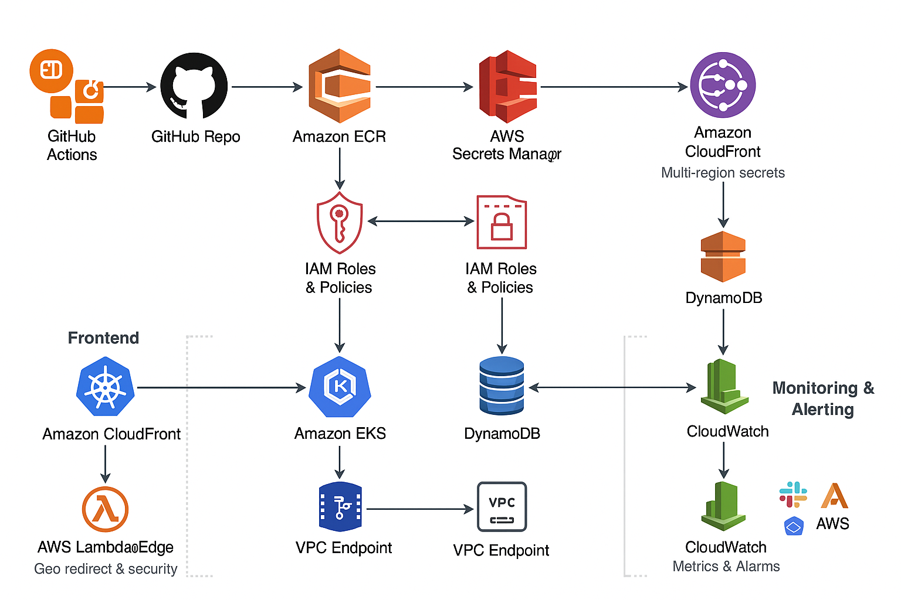

# AWS EKS Secure Multi-Region Terraform Project

## Overview

This project deploys a secure, scalable, geo-aware 3-tier architecture on AWS using the following services:

- Amazon EKS (Kubernetes Cluster)  
- Amazon ECR (Docker Container Registry)  
- Amazon DynamoDB (NoSQL Database)  
- AWS Secrets Manager (Multi-region secrets)  
- Amazon CloudFront + ACM + Route53 (CDN, HTTPS, Geo DNS)  
- AWS Lambda@Edge (Geo-based redirect and security)  
- AWS WAF (Web Application Firewall)  
- Amazon CloudWatch + SNS (Monitoring and alerts)  
- GitHub Actions (CI/CD Pipeline)

---

## Directory Structure

- `modules/`: Reusable Terraform modules (Secrets Manager, DynamoDB, etc.)  
- `.github/workflows/`: GitHub Actions workflow definitions  
- `k8s/`: Kubernetes manifests (single YAML containing Deployment, Service, HPA, and Ingress)  
- `lambda/`: Lambda function source code and deployment packages  
- `scripts/`: Helper scripts for automation  
- Core Terraform files (`main.tf`, `variables.tf`, `outputs.tf`, `provider.tf`)

---

## Kubernetes Manifests

All Kubernetes resources including Deployment, Service, Horizontal Pod Autoscaler (HPA), and Ingress are defined in a **single file** located at `k8s/deployment.yaml`. This simplifies deployment and management for small to medium-sized projects.  

For larger projects, separating these resources into individual files (e.g., `deployment.yaml`, `service.yaml`, `ingress.yaml`, `hpa.yaml`) is recommended to improve maintainability.

---

## Getting Started

1. **Prerequisites**  
   - Install AWS CLI and configure credentials  
   - Install Terraform (v1.0 or higher)  
   - Create required GitHub repository secrets:  
     - `AWS_ROLE_ARN`  
     - `ECR_REPO`  
     - `AWS_REGION`  
     - `SLACK_WEBHOOK_URL`  
     - `TWILIO_ACCOUNT_SID`  
     - `TWILIO_AUTH_TOKEN`  
     - and others as needed  

2. **Terraform Deployment**  
   - Initialize Terraform:  
     ```bash
     terraform init
     ```  
   - Apply Terraform for the target environment (dev/test/prod):  
     ```bash
     terraform apply -var-file="dev.tfvars"
     ```  
   - This will provision all AWS resources and deploy infrastructure.

3. **CI/CD Pipeline**  
   - On pushes to GitHub branches (`dev`, `test`, `main`), GitHub Actions will:  
     - Build and push Docker images to ECR  
     - Deploy updated manifests to EKS  
     - Perform rollback on failure  

4. **Secrets Management**  
   - Secrets (Twilio tokens, Slack webhook URLs, etc.) are managed centrally via AWS Secrets Manager in multiple regions.

5. **DNS and Geo-routing**  
   - Route53 with Geo DNS and Lambda@Edge provide region-specific routing.

6. **Monitoring & Alerts**  
   - CloudWatch monitors key metrics and billing thresholds.  
   - SNS topics send alerts to email, Slack, and WhatsApp (via Lambda).

---

## Security Considerations

- **Least privilege IAM roles** are used throughout.  
- **VPC Endpoints** limit network access to DynamoDB.  
- **WAF** blocks common web attacks like SQL Injection.  
- **IP Whitelisting and Schedule Restrictions** restrict access during off-hours.

---

## Folder Overview

- **modules/**: Contains reusable Terraform modules for secret management and DynamoDB table creation.  
- **lambda/**: Contains source code and packaged Lambda functions used for geo-redirect and WhatsApp alerts.  
- **k8s/**: Kubernetes deployment manifests (single YAML file combining multiple resource definitions).  
- **.github/workflows/**: GitHub Actions CI/CD workflow definitions.  
- **scripts/**: Utility scripts for automating git pushes of workflow files.  

---

## Terraform Backend Configuration and State Management

To support multiple environments with isolated state management, **backend configuration files** have been added to the project:

- `backend-dev.tfvars`  
- `backend-test.tfvars`  
- `backend-prod.tfvars`

These files configure remote Terraform state storage using **AWS S3 buckets** for the state files and **DynamoDB tables** for state locking and consistency.

## Terraform Deployment

Initialize Terraform with backend config for your target environment:

```bash
terraform init -backend-config=backend-dev.tfvars
```

## Apply Terraform for the target environment (dev/test/prod):

In this project dev and test enviroments are deployed automaticly. Only prod enviroment must be applied manuel.

```bash
terraform apply -var-file="prod.tfvars"
```

This will provision all AWS resources and deploy infrastructure.

## Contact

For questions or support, please contact: y.duymac@gmail.com


